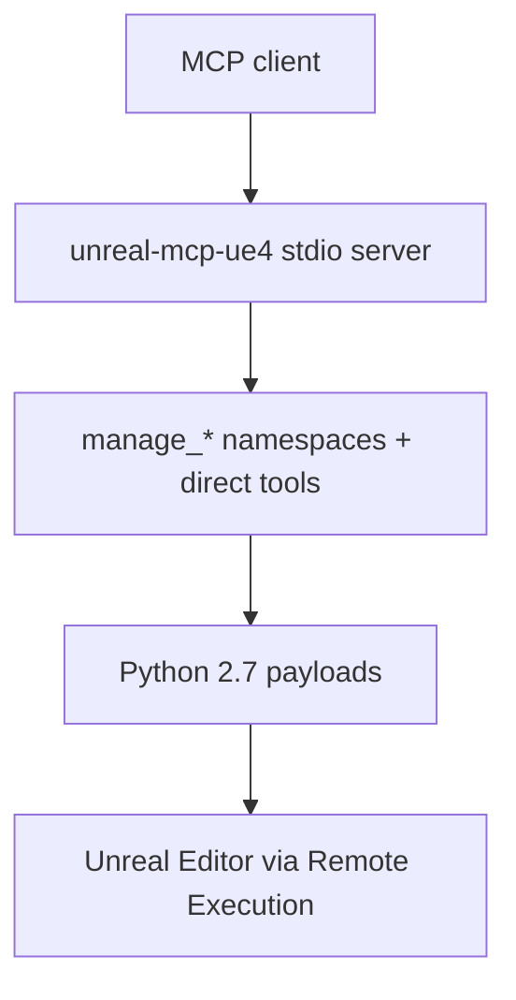

# unreal-mcp-ue4-for-OHD
> UE4.25.4-first MCP server for Operation Harsh Doorstop modding via Unreal Python Remote Execution (stdio transport)

<div align="center"><a href="https://github.com/RibatTRW/unreal-mcp-ue4-for-OHD/actions/workflows/ci.yml"></a></div>

Fork of [runreal/unreal-mcp](https://github.com/runreal/unreal-mcp), heavily refactored UE4-first (via a UE4.27.2 stage) and retargeted here to UE4.25.4 for the OHDCore Mod Kit: same transport and tool surface, with version pins, docs links, and Python-dialect constraints adjusted for the kit's embedded Python 2.7.14. Port, tool, docs, and smoke-test work were developed with assistance from OpenAI Codex.

> [!NOTE]
> Still under active development — expect bugs, rough edges, and UE4.25-specific limitations.
> Published package: [`unreal-mcp-ue4`](https://www.npmjs.com/package/unreal-mcp-ue4) · Registry name: `io.github.conaman/unreal-mcp-ue4`

> [!CAUTION]
> Not an official Epic Games project. Any connected MCP client can inspect and modify your open editor session — use a disposable test project first, especially for asset or world-generation tools.

## Contents

- [Requirements](#requirements) · [Setup](#setup) · [Editor remote execution](#editor-remote-execution) · [Usage](#usage) · [Sidebar tab](#sidebar-tab) · [Internals](#internals) · [Testing](#testing) · [Publishing](#publishing) · [Available Tools](#available-tools) · [Contributing](#contributing) · [Troubleshooting](#troubleshooting) · [Notes and Limitations](#notes-and-limitations) · [Roadmap](#roadmap) · [License](#license)

## Requirements

| Need | Pin |
|------|-----|
| Unreal Engine | `4.25.4` via OHDCore Mod Kit: engine tree `HDEngine/`, project `HDGame/HarshDoorstop/HarshDoorstop.uproject`, launched with `LaunchEditor.bat` |
| Runtime | Node.js `18+`, `npm` |
| Client | Any MCP client (Codex, Claude Code, Claude Desktop, Cursor, Copilot in a supported IDE) |
| Editor payloads | Python 2.7 only (kit embeds 2.7.14): no f-strings, single-argument `print()`, no `pathlib`-era idioms |

Reference: [Unreal Engine Python API 4.25](https://dev.epicgames.com/documentation/en-us/unreal-engine/python-api/?application_version=4.25). No custom C++ plugin is required — the server uses the editor's built-in Python Remote Execution. UE5-only scripting features are not reintroduced; unreliable graph/binding flows are excluded from the MCP surface or return a clear message instead of failing silently.



## Setup

Autonomous agents setting up unattended: follow the ordered guide in [docs/agent-setup.md](docs/agent-setup.md).

```bash
npm install -g unreal-mcp-ue4   # recommended; then reference the `unreal-mcp-ue4` binary
npx unreal-mcp-ue4              # one-off invocation
```

Local source checkout:

```bash
git clone https://github.com/RibatTRW/unreal-mcp-ue4-for-OHD.git
cd unreal-mcp-ue4-for-OHD
npm install
npm run build   # produces `dist/bin.js`, `dist/index.js`, `dist/editor/tools.js`
```

One install, then one line per client (global vs local-checkout variants). All clients call the same 34 tools over stdio (3 session-info + 3 direct actor CRUD primitives + 28 `manage_*` namespaces):

| Client | Global install | Local checkout |
|--------|---------------|----------------|
| Claude | `claude mcp add --scope user unreal-mcp-ue4 -- unreal-mcp-ue4` | `claude mcp add --scope user unreal-mcp-ue4 -- node /absolute/path/to/unreal-mcp-ue4-for-OHD/dist/bin.js` |
| Codex | `codex mcp add unreal-ue4 -- unreal-mcp-ue4` | `codex mcp add unreal-ue4 -- node /absolute/path/to/unreal-mcp-ue4-for-OHD/dist/bin.js` |
| Copilot | `.vscode/mcp.json` → `{ "servers": { "unreal-ue4": { "command": "unreal-mcp-ue4", "args": [] } } }`, then start the server from the MCP config UI and confirm `unreal-ue4` is in the tools picker | same file with `"command": "node", "args": ["/absolute/path/to/unreal-mcp-ue4-for-OHD/dist/bin.js"]` |

Copilot docs: [Extending GitHub Copilot Chat with MCP servers](https://docs.github.com/en/copilot/how-tos/provide-context/use-mcp-in-your-ide/extend-copilot-chat-with-mcp) · [About Model Context Protocol in GitHub Copilot](https://docs.github.com/en/copilot/concepts/context/mcp)

## Editor remote execution

Verified live against the kit. In the OHD editor (`LaunchEditor.bat` → `HarshDoorstop.uproject`):

1. `Edit -> Plugins`: enable `Python Editor Script Plugin` (ships disabled). `Editor Scripting Utilities` is already enabled — no action needed. Enable `SequencerScripting` (ships disabled) only for advanced `manage_sequence` actions: actor binding, track/key edits, camera cuts, playback ranges, speed-track analysis.
2. Restart if prompted → `Edit -> Project Settings -> Plugins -> Python` → enable `Enable Remote Execution` (endpoint `239.0.0.1:6766`, bind `0.0.0.0`, raise Multicast TTL from kit default `0` to `1`). Restart again if needed.
3. Keep the project open while using the server or tests; restart the editor after any plugin/Python setting change.
4. No UMG plugin to install (tooling uses shipped editor modules). Do mod experiments in a throwaway content-only mod (Create Mod in the editor); never edit shipped `Plugins/*`, `HDAssets`, or engine content.

Connection env overrides (`UNREAL_MCP_*`):

| Var | Default |
|-----|---------|
| `UNREAL_MCP_BIND_ADDRESS` / `UNREAL_MCP_COMMAND_ADDRESS` | first non-internal IPv4 |
| `UNREAL_MCP_COMMAND_PORT` | `6776` |
| `UNREAL_MCP_MULTICAST_ADDRESS` / `UNREAL_MCP_MULTICAST_PORT` / `UNREAL_MCP_MULTICAST_TTL` | `239.0.0.1` / `6766` / `1` |
| `UNREAL_MCP_RETRY_COUNT` / `UNREAL_MCP_RETRY_DELAY_MS` | built-in retry policy |

## Usage

- Prefer `manage_*` namespace tools (action-specific input schemas are exposed over MCP). Namespaces dispatch through `action` + `params`. Canonical reads: `manage_editor.project_info` (project), `manage_editor.map_info` + `manage_level.world_outliner` (map/level). Discover the surface with `manage_tools` (`list_namespaces`).
- Direct tools (`get_unreal_*`, `editor_create/update/delete_object`) are low-level primitives for session path discovery and actor CRUD.
- `manage_editor.run_python` is the escape hatch for debugging, prototyping, and UE4.25 API gaps — still Python 2.7-compatible.

First run: open the kit project and wait for load → confirm plugins + remote execution → `npm install -g unreal-mcp-ue4` (or `npm run build`) → open/start the client session → run something read-only:

- `unreal-mcp-ue4 --version` (prints version, no stdio transport)
- `manage_editor` + `action: "project_info"` / `"map_info"` · `manage_level` + `"world_outliner"` · `manage_tools` + `"list_namespaces"`
- In prose: `Get project info from the unreal-ue4 server.` · `List the actors in the current level.` · `Spawn a StaticMeshActor named TestCube at 0,0,100.`

What the server can do: read project/map/asset/actor info; spawn, inspect, move, delete level actors; search assets and inspect references/metadata; create `DataAsset`/`StringTable` and other common UE4 data assets; create/edit Blueprint assets and Widget Blueprint trees where UE4.25 Python exposes the APIs.

## Sidebar tab

One call sets up the EUW (Editor Utility Widget) sidebar tab end to end — an EUW asset plus a WebBrowser child hosting a web page beside the viewport:

`manage_widget` + `action: "setup_sidebar_tab"`, params `widget_blueprint_path` (e.g. `/Game/DSHSidebar`), `url` (any page URL; the DSH web GUI is the convention), `use_template: true` (missing target is duplicated from the golden template — full-fill `DSHBrowser` + verified On Key Down shortcut fix — instead of built from scratch; re-runs are idempotent, reusing existing targets while refreshing URL/layout).

Caveats: non-DSH pages get no editor-driving loop (typing in them does nothing to the viewport); the 4.25 CEF gate applies (a minimal page renders where a full app shows blank); first template use reports `template_staged` (the 4.25 Asset Registry can't see the staged `/Game` file until restart — restart, then re-run); a custom `browser_widget_name` is ignored on the template path with a warning and DSH asset/browser names stay; if the opened tab looks stale, Compile the widget blueprint in the designer, then dock it beside the viewport.

## Internals

TypeScript 7 native toolchain (`tsc -p tsconfig.json`, ES2022, Node 18 proven), stdio transport, Effect-migrated dispatch/connection layers (Zod stays at the MCP SDK call-site — the SDK only accepts Zod). Recent performance work:

| Item | Shape |
|------|-------|
| Prelude cache | static Python prelude cached in the editor session behind the render seam; cacheable renders are ~1–5% of full bytes, miss resends once (`scripts/check-prelude-cache.mjs`) |
| Schema compaction | seven heaviest tool schemas compacted to cut the `listTools` payload; surface pinned by `scripts/__snapshots__/list-tools.snapshot.json` (`scripts/check-tool-surface.mjs`) |
| Validation fragments | shared `limit`/asset-path validators used across namespaces |
| Batch design | harness-level chaining memo in [docs/w1-batch-design-memo.md](docs/w1-batch-design-memo.md), offline prototype green (`scripts/check-batch-prototype.mjs`); live gate not run |
| Connect health-hint | short-lived healthy-connection hint skips redundant reconnects |

## Testing

| Command | Needs editor? | Covers |
|---------|---------------|--------|
| `npm run check:py27` | No | Python 2.7 dialect gate — run after touching `server/editor/scripts` |
| `npm run test:no-unreal` | No | offline: MCP startup, tool discovery, namespace action schemas, param validation, payload codec, batch prototype, prelude cache, tool surface, dispatch envelope, schema parity, connection session |
| `npm run test:e2e` | Yes | builds, spawns its own MCP server process, connects to the open editor: startup, discovery, project/map/outliner reads, source-control reads, direct-tool actor create/update/delete, namespace actor spawn/search/transform/inspect/delete, namespace dispatch |
| `npm run test:e2e -- --with-assets` | Yes | above + Blueprint create/component-edit/mesh-assign/compile, DataAsset create + metadata, StringTable, texture import + metadata, Widget create + TextBlock/Button + CanvasPanel/child-widget flows; temp assets under `/Game/MCP/Tests`, removed unless `--keep-assets` |
| `node scripts/probe-once.mjs --file <py> [--code <snip>] [--timeout-ms 20000] [--verbose]` | Yes | one-shot raw Python 2.7 probe through the built server, bypassing the editor console |

Runner options: `--keep-assets` (inspect results in the Content Browser), `--skip-namespace` (skip namespace-dispatch portion), `--verbose` (MCP server stderr), `--help` (options without rebuilding). Windows PowerShell:

```powershell
cd C:\dev\unreal-mcp-ue4-for-OHD
npm install
npm run test:no-unreal
npm run test:e2e
npm run test:e2e -- --with-assets
```

Success = `[PASS]` on every step; actor tests visibly create then remove temp actors (both surfaces); asset tests create then remove temp Blueprint/DataAsset/StringTable/Texture/Widget assets. Workflow: `test:no-unreal` → `test:e2e` → `test:e2e -- --with-assets` → try the real client → use a test project before production content.

## Publishing

Version format `YYYY.M.D-N`, unified everywhere (current `2026.5.12-11`) — bump it, then:

```bash
npm run publish:check                                  # typecheck + rebuild + tarball dry-run
npm run test:e2e -- --with-assets --skip-build         # when an OHD (UE4.25) editor is available
npm publish --tag latest                               # explicit dist-tag required (semver prerelease suffix)
```

`prepack` runs `npm run build`, so the tarball always uses a fresh `dist`.

## Available Tools

Notes call out important requirements or UE4.25 limitations when they matter. Empty notes mean there are no additional caveats beyond normal editor setup.

The recommended public surface is the `manage_*` namespace layer. Prefer `manage_editor.project_info`, `manage_editor.map_info`, and `manage_level.world_outliner` as canonical read entry points, and treat the small direct-tool set as low-level primitives for path discovery and actor CRUD.

### Editor Session Info

<table width="100%">
	<colgroup>
		<col width="18%">
		<col width="52%">
		<col width="30%">
	</colgroup>
	<thead>
		<tr>
			<th width="18%">Tool</th>
			<th width="52%">Description</th>
			<th width="30%">Notes</th>
		</tr>
	</thead>
	<tbody>
	<tr>
		<td width="18%"><code>get_unreal_engine_path</code></td>
		<td width="52%">Get the active Unreal Engine root path from the connected editor session</td>
		<td width="30%">&nbsp;</td>
	</tr>
	<tr>
		<td width="18%"><code>get_unreal_project_path</code></td>
		<td width="52%">Get the active Unreal project file path from the connected editor session</td>
		<td width="30%">&nbsp;</td>
	</tr>
	<tr>
		<td width="18%"><code>get_unreal_version</code></td>
		<td width="52%">Get the active Unreal Engine version string from the connected editor session</td>
		<td width="30%">&nbsp;</td>
	</tr>
	</tbody>
</table>

### Core Direct Tools

<table width="100%">
	<colgroup>
		<col width="18%">
		<col width="52%">
		<col width="30%">
	</colgroup>
	<thead>
		<tr>
			<th width="18%">Tool</th>
			<th width="52%">Description</th>
			<th width="30%">Notes</th>
		</tr>
	</thead>
	<tbody>
	<tr>
		<td width="18%"><code>editor_create_object</code></td>
		<td width="52%">Create a new object/actor in the world</td>
		<td width="30%">&nbsp;</td>
	</tr>
	<tr>
		<td width="18%"><code>editor_update_object</code></td>
		<td width="52%">Update an existing object/actor in the world</td>
		<td width="30%">&nbsp;</td>
	</tr>
	<tr>
		<td width="18%"><code>editor_delete_object</code></td>
		<td width="52%">Delete an object/actor from the world</td>
		<td width="30%">&nbsp;</td>
	</tr>
	</tbody>
</table>

### Core Tool Namespaces

<table width="100%">
	<colgroup>
		<col width="18%">
		<col width="52%">
		<col width="30%">
	</colgroup>
	<thead>
		<tr>
			<th width="18%">Tool</th>
			<th width="52%">Description</th>
			<th width="30%">Notes</th>
		</tr>
	</thead>
	<tbody>
	<tr>
		<td width="18%"><code>manage_asset</code></td>
		<td width="52%">Asset tool namespace for listing, searching, inspecting, exporting, validating, duplicating, renaming, moving, deleting, saving, and folder-management actions.</td>
		<td width="30%">&nbsp;</td>
	</tr>
	<tr>
		<td width="18%"><code>manage_actor</code></td>
		<td width="52%">Actor tool namespace for listing, searching, spawning, deleting, transforming, and inspecting level actors.</td>
		<td width="30%">&nbsp;</td>
	</tr>
	<tr>
		<td width="18%"><code>manage_editor</code></td>
		<td width="52%">Editor tool namespace for run_python, console_command, project_info, map_info, world_outliner, is_pie_running, start_pie, stop_pie, screenshot, and move_camera actions.</td>
		<td width="30%">Canonical namespace for project_info, map_info, world_outliner, start_pie, stop_pie, is_pie_running, console_command, and run_python.</td>
	</tr>
	<tr>
		<td width="18%"><code>manage_level</code></td>
		<td width="52%">Level tool namespace for map inspection, actor listing, world outliner inspection, and preset structure creation actions.</td>
		<td width="30%">&nbsp;</td>
	</tr>
	<tr>
		<td width="18%"><code>manage_system</code></td>
		<td width="52%">System tool namespace for console commands and asset validation actions.</td>
		<td width="30%">Slim namespace for console and validation helpers; use manage_editor for canonical project and map inspection.</td>
	</tr>
	<tr>
		<td width="18%"><code>manage_inspection</code></td>
		<td width="52%">Inspection tool namespace for asset, actor, map, and basic Blueprint summary actions.</td>
		<td width="30%">Asset, actor, and map inspection work; Blueprint inspection is limited to high-level asset summaries in stock UE4.25 Python.</td>
	</tr>
	<tr>
		<td width="18%"><code>manage_tools</code></td>
		<td width="52%">Tool-namespace registry for listing registered tool namespaces and describing supported actions. Use this as the discovery entry point for the namespace-first MCP surface.</td>
		<td width="30%">&nbsp;</td>
	</tr>
	<tr>
		<td width="18%"><code>manage_source_control</code></td>
		<td width="52%">Source-control tool namespace for provider inspection and file or package source-control operations.</td>
		<td width="30%">provider_info works broadly, but file and package operations require a configured and available Unreal source-control provider, returning success:false with unavailable:'source_control_no_provider' when none is enabled.</td>
	</tr>
	</tbody>
</table>

### World & Environment Tool Namespaces

<table width="100%">
	<colgroup>
		<col width="18%">
		<col width="52%">
		<col width="30%">
	</colgroup>
	<thead>
		<tr>
			<th width="18%">Tool</th>
			<th width="52%">Description</th>
			<th width="30%">Notes</th>
		</tr>
	</thead>
	<tbody>
	<tr>
		<td width="18%"><code>manage_lighting</code></td>
		<td width="52%">Lighting tool namespace for spawning common light actors, transforming them, and inspecting level lighting state.</td>
		<td width="30%">&nbsp;</td>
	</tr>
	<tr>
		<td width="18%"><code>manage_level_structure</code></td>
		<td width="52%">Level-structure tool namespace for preset town, house, mansion, tower, wall, bridge, and fortress construction actions.</td>
		<td width="30%">&nbsp;</td>
	</tr>
	<tr>
		<td width="18%"><code>manage_volumes</code></td>
		<td width="52%">Volume tool namespace for spawning common engine volumes and applying delete or transform actions.</td>
		<td width="30%">&nbsp;</td>
	</tr>
	<tr>
		<td width="18%"><code>manage_navigation</code></td>
		<td width="52%">Navigation tool namespace for spawning navigation volumes and proxies plus basic map inspection actions.</td>
		<td width="30%">&nbsp;</td>
	</tr>
	<tr>
		<td width="18%"><code>manage_environment</code></td>
		<td width="52%">Environment-building tool namespace for preset town, arch, staircase, pyramid, and maze generation actions.</td>
		<td width="30%">&nbsp;</td>
	</tr>
	<tr>
		<td width="18%"><code>manage_splines</code></td>
		<td width="52%">Spline tool namespace for spawning a spline-host actor or Blueprint and then transforming or deleting it.</td>
		<td width="30%">&nbsp;</td>
	</tr>
	<tr>
		<td width="18%"><code>manage_geometry</code></td>
		<td width="52%">Geometry tool namespace for wall, arch, staircase, and pyramid preset construction actions.</td>
		<td width="30%">&nbsp;</td>
	</tr>
	<tr>
		<td width="18%"><code>manage_effect</code></td>
		<td width="52%">Effects tool namespace for spawning debug-shape actors, assigning materials, tinting them, and deleting them.</td>
		<td width="30%">&nbsp;</td>
	</tr>
	</tbody>
</table>

### Content & Authoring Tool Namespaces

<table width="100%">
	<colgroup>
		<col width="18%">
		<col width="52%">
		<col width="30%">
	</colgroup>
	<thead>
		<tr>
			<th width="18%">Tool</th>
			<th width="52%">Description</th>
			<th width="30%">Notes</th>
		</tr>
	</thead>
	<tbody>
	<tr>
		<td width="18%"><code>manage_skeleton</code></td>
		<td width="52%">Skeleton tool namespace for searching Skeleton and SkeletalMesh assets and inspecting their metadata.</td>
		<td width="30%">&nbsp;</td>
	</tr>
	<tr>
		<td width="18%"><code>manage_material</code></td>
		<td width="52%">Material tool namespace for listing materials, applying them to actors or Blueprints, and tinting them with material instances.</td>
		<td width="30%">&nbsp;</td>
	</tr>
	<tr>
		<td width="18%"><code>manage_texture</code></td>
		<td width="52%">Texture tool namespace for searching texture assets, importing image files as textures, and reading their asset metadata.</td>
		<td width="30%">import_texture requires a local image file path that is accessible from the machine running the Unreal Editor session.</td>
	</tr>
	<tr>
		<td width="18%"><code>manage_data</code></td>
		<td width="52%">Data tool namespace for searching data assets, creating common data containers, and inspecting their asset metadata.</td>
		<td width="30%">&nbsp;</td>
	</tr>
	<tr>
		<td width="18%"><code>manage_blueprint</code></td>
		<td width="52%">Blueprint tool namespace for Blueprint creation, component editing, compilation, and basic Blueprint summary actions.</td>
		<td width="30%">Blueprint asset and component edits work; read returns high-level graph summaries only, while pin wiring, variable authoring, and variable/function detail helpers are excluded from the MCP surface in stock UE4.25 Python.</td>
	</tr>
	<tr>
		<td width="18%"><code>manage_sequence</code></td>
		<td width="52%">Sequence tool namespace for creating, searching, inspecting, and editing LevelSequence assets, including bindings, tracks, sections, keys, camera cuts, playback ranges, and speed-track time calculations.</td>
		<td width="30%">Advanced binding, track, section, key, camera-cut, playback-range, and speed-track analysis actions require the UE4.25 SequencerScripting plugin in the target project.</td>
	</tr>
	<tr>
		<td width="18%"><code>manage_audio</code></td>
		<td width="52%">Audio tool namespace for importing audio files, searching audio assets, and inspecting their asset metadata.</td>
		<td width="30%">&nbsp;</td>
	</tr>
	<tr>
		<td width="18%"><code>manage_widget</code></td>
		<td width="52%">Widget tool namespace for UMG Blueprint creation, widget-tree inspection, widget-tree edits, CanvasPanel root normalization, and viewport spawning actions. Use inspect_tree to verify designer contents, add_child_widget for nested layout work, and ensure_canvas_root when absolute CanvasPanel positioning is required.</td>
		<td width="30%">create_widget_blueprint, inspect_tree, add_text_block, add_button, and ensure_canvas_root work; use add_child_widget for normal nested layout, and use ensure_canvas_root before CanvasPanel positioning or sizing if the root is another panel. setup_sidebar_tab builds a WebBrowser sidebar tab end to end (EUW asset, browser child, URL, open tab); use_template duplicates the golden template (browser + On Key Down shortcut fix included) instead of building from scratch. The sidebar url accepts any page URL (DSH web GUI is the convention); DSH asset/browser names stay, non-DSH pages get no editor loop and face the 4.25 CEF gate. add_to_viewport requires PIE; start_pie_if_needed can request PIE and may require a retry.</td>
	</tr>
	</tbody>
</table>

### Gameplay & Systems Tool Namespaces

<table width="100%">
	<colgroup>
		<col width="18%">
		<col width="52%">
		<col width="30%">
	</colgroup>
	<thead>
		<tr>
			<th width="18%">Tool</th>
			<th width="52%">Description</th>
			<th width="30%">Notes</th>
		</tr>
	</thead>
	<tbody>
	<tr>
		<td width="18%"><code>manage_animation_physics</code></td>
		<td width="52%">Animation-and-physics tool namespace for physics Blueprint spawning, Blueprint physics settings, and Blueprint compilation actions.</td>
		<td width="30%">&nbsp;</td>
	</tr>
	<tr>
		<td width="18%"><code>manage_input</code></td>
		<td width="52%">Input tool namespace for creating classic UE4 input mappings.</td>
		<td width="30%">Focused on classic UE4 input-mapping authoring; use manage_editor.project_info for the canonical project summary.</td>
	</tr>
	<tr>
		<td width="18%"><code>manage_behavior_tree</code></td>
		<td width="52%">Behavior-tree tool namespace for creating, searching, and inspecting BehaviorTree assets.</td>
		<td width="30%">Focused on BehaviorTree asset discovery and inspection; use manage_editor.project_info for the canonical project summary.</td>
	</tr>
	<tr>
		<td width="18%"><code>manage_gas</code></td>
		<td width="52%">GAS tool namespace for searching gameplay-ability-related assets and inspecting their asset metadata.</td>
		<td width="30%">&nbsp;</td>
	</tr>
	</tbody>
</table>

### Excluded Capability Areas

These capability areas are intentionally not exposed through the MCP surface in this UE4.25 port because they fail reliably in the current Python environment and only add prompt or context overhead until a native bridge exists.

| Capability Area | Effect on MCP Surface | Why It Is Excluded |
|-----------------|-----------------------|---------------------|
| Blueprint event-graph event insertion | Related event-node and input-action helpers are excluded from the MCP surface. | The current UE4.25 Python environment does not expose reliable event graph access or K2 event reference setup. |
| Blueprint graph inspection and node search | Graph-analysis, graph-inspection, and node-search helpers are excluded from the MCP surface. | The current UE4.25 Python environment does not expose Blueprint graph arrays such as UbergraphPages or FunctionGraphs reliably enough for deterministic inspection. |
| Low-level Blueprint graph node creation | Generic graph-node helpers and related self or component reference insertion helpers are excluded from the MCP surface. | The current UE4.25 Python environment does not expose stable low-level graph node creation or member-reference wiring. |
| Blueprint function-call node authoring | Function-node helpers that depend on editor graph member-reference setup are excluded from the MCP surface. | The current UE4.25 Python environment does not expose reliable function-call node reference setup. |
| Blueprint variable and function metadata inspection | Variable-detail and function-detail helpers are excluded from the MCP surface. | The current UE4.25 Python environment does not expose NewVariables or FunctionGraphs reliably enough for deterministic inspection. |
| Blueprint variable authoring | Variable-creation helpers are excluded from the MCP surface. | BPVariableDescription and EdGraphPinType are not exposed in the current UE4.25 Python environment. |
| UMG delegate-binding authoring | Widget event-binding and text-binding helpers are excluded from the MCP surface. | DelegateEditorBinding is not exposed in the current UE4.25 Python environment. |

## Contributing

`main` is protected by the `protect-main` ruleset (PRs only — no direct pushes, force-pushes, or deletions; review threads must resolve). Branch off `main`, open a PR back, and before pushing run `npm run typecheck` + `npm run check:py27` (plus `npm run test:no-unreal` when possible). Keep payloads Python 2.7-compatible; the tables above regenerate during build, so run `npm run build` before committing doc changes.

## Troubleshooting

- **`Remote node is not available`**: open the editor fully first; verify `Python Editor Script Plugin`, `Editor Scripting Utilities`, and `Enable Remote Execution` are enabled; restart after changing any of them.
- **Connection/discovery on Windows**: allow `UnrealEditor.exe` and `node.exe` through Windows Defender Firewall. Discovery is UDP multicast on `239.0.0.1:6766`, command channel on `6776`. Override the bind address with `UNREAL_MCP_BIND_ADDRESS` or `UNREAL_MCP_COMMAND_ADDRESS` when the editor can't discover/connect. In JSON configs, escape backslashes or use forward slashes.
- **Client can't find `unreal-mcp-ue4` or `node`**: put the npm global binary dir on the client's `PATH` (or use the absolute `unreal-mcp-ue4` path); for source checkouts use the absolute `node`/`node.exe` path instead of relying on `PATH`.
- **Blueprint graph / UMG binding commands unavailable**: expected — Widget creation + tree editing work, but delegate bindings and runtime viewport flows don't; Blueprint asset/component/compile + summaries work, but graph inspection, pin wiring, and variable/function metadata are excluded (stock UE4.25 Python doesn't expose them). Full list under `Excluded Capability Areas` above.

## Notes and Limitations

- World/structure tools use UE4.25-friendly preset builders on engine basic-shape assets.
- UMG editing works with native `PanelWidget` parents; absolute positioning targets `CanvasPanel` slots — run `manage_widget.ensure_canvas_root` first when the root isn't a Canvas. Reparenting the root widget and named-slot edits aren't handled; delegate bindings remain unavailable.
- Blueprint asset/component editing works; graph inspection, pin wiring, and variable/function metadata inspection are excluded.
- The surface mixes granular tools and action-based namespaces so clients can work at different abstraction levels.

## Roadmap

- [x] Improve Code Architecture (Effect-migration phases 0-7 landed)
- [x] Add Dsh Harness Support (`manage_widget.setup_sidebar_tab` + golden template)
- [x] Add a agent.md so agents can install it easily (landed as `docs/agent-setup.md`)
- [x] Add GitHub Actions CI (`.github/workflows/ci.yml` green on main + Tests badge live; `protect-main` ruleset PR-only with required status checks)
- [x] Cut a first fork release (tags exist, e.g. `2026.5.12-11`; published to npm)
- [ ] Publish registry rename to `unreal-mcp-ue4-for-ohd` under `io.github.ribattrw` (decision made; merge + publish pending)

## License

Licensed under the [MIT License](LICENSE).
