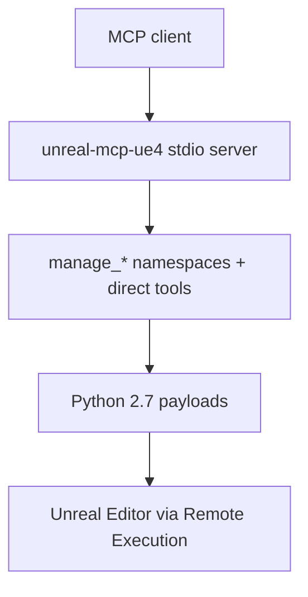

# unreal-mcp-ue4-for-OHD
> UE4.25.4-focused MCP server for Operation Harsh Doorstop modding using Unreal Python Remote Execution

<div align="center"></div>

`unreal-mcp-ue4` started from the core idea and early workflow shape of [runreal/unreal-mcp](https://github.com/runreal/unreal-mcp), but it has since been heavily refactored for Unreal Engine 4.27.2 and expanded with many new tools, UE4-specific compatibility layers, documentation, and smoke coverage. At this point, the original inspiration remains, but the public surface and day-to-day behavior are substantially different and UE4-first. This fork retargets that server to UE4.25.4 for the Operation Harsh Doorstop mod kit (OHDCore Mod Kit): same transport and tool surface, version pins, docs links, and Python-dialect constraints adjusted for the kit's embedded Python 2.7.

This port and the follow-up tool, documentation, and smoke-test work were developed with assistance from OpenAI Codex.

> [!NOTE]
> This project is still under active development, so bugs, rough edges, and UE4.25-specific limitations may still surface.
>
> Published package: [`unreal-mcp-ue4`](https://www.npmjs.com/package/unreal-mcp-ue4)
> Registry name: `io.github.conaman/unreal-mcp-ue4`

## Table of Contents

- [Overview](#overview)
- [Origin](#origin)
- [Requirements](#requirements)
- [MCP Client Setup](#mcp-client-setup)
- [Usage](#usage)
- [API Reference](#api-reference)
- [Testing](#testing)
- [Publishing to npm](#publishing-to-npm)
- [Contributing](#contributing)
- [Troubleshooting](#troubleshooting)
- [Notes and Limitations](#notes-and-limitations)
- [Roadmap](#roadmap)
- [License](#license)

## Overview

- No custom Unreal C++ plugin from this repository is required.
- The server talks to the editor through Unreal's built-in Python Remote Execution path.
- The tool surface is organized into granular tools and higher-level tool namespaces.
- UE5-only editor scripting features are not reintroduced; UE4.25-safe operations work normally, while unreliable graph or binding flows are either excluded from the MCP surface or return a clear message instead of silently failing.
- All Python sent to the OHD editor must be Python 2.7-compatible (the kit embeds Python 2.7.14): no f-strings, `print()` single-argument form, no `pathlib`-era idioms.

<!-- Experimental: if rendering fails, preview on GitHub -->


## Origin

- Original inspiration and starting point: [runreal/unreal-mcp](https://github.com/runreal/unreal-mcp)
- The current codebase has gone through extensive UE4.27-focused refactoring, architecture changes, and tool expansion; this fork retargets it to UE4.25.4 for OHD modding.
- In practice, the shared idea is still visible, but the implementation, scope, and supported workflows now reflect a separate UE4-first project.
- Unreal Python API reference: [Unreal Engine Python API 4.25](https://dev.epicgames.com/documentation/en-us/unreal-engine/python-api/?application_version=4.25)

> [!CAUTION]
> This is not an official Epic Games project. Any connected MCP client can inspect and modify your open Unreal Editor session. Use a disposable test project first, especially when trying asset or world-generation tools.

## Requirements

- Unreal Engine `4.25.4` (OHDCore Mod Kit: `HDEngine/` engine tree, game project `HDGame/HarshDoorstop/HarshDoorstop.uproject`, launched via `LaunchEditor.bat`)
- Node.js `18+`
- `npm`
- An MCP client such as Codex, Claude Code, Claude Desktop, Cursor, or GitHub Copilot in a supported IDE

## MCP Client Setup

This is the most important setup step: your MCP client must know how to launch `unreal-mcp-ue4`.

### 1. Install the server

Recommended global install:

```bash
npm install -g unreal-mcp-ue4
```

After the global install, use the published `unreal-mcp-ue4` binary in your client configuration.

One-off invocation with `npx`:

```bash
npx unreal-mcp-ue4
```

Local source checkout:

```bash
git clone https://github.com/RibatTRW/unreal-mcp-ue4-for-OHD.git
cd unreal-mcp-ue4-for-OHD
npm install
npm run build
```

Successful build output should create `dist/bin.js`, `dist/index.js`, and `dist/editor/tools.js`. Use the `dist/bin.js` path in the local source checkout examples below.

### 2. Register the server in your client

Use the global examples when you installed with `npm install -g unreal-mcp-ue4`. Use the local source checkout examples when you are developing from a cloned repository. Once registered, all three clients call the same tools over stdio (including `manage_widget.setup_sidebar_tab`); the sidebar `url` accepts any page URL and the golden template keeps its DSH asset/browser names on every client.

<details><summary>Claude</summary>

Global npm install:

```bash
claude mcp add --scope user unreal-mcp-ue4 -- unreal-mcp-ue4
```

Local source checkout:

```bash
claude mcp add --scope user unreal-mcp-ue4 -- node /absolute/path/to/unreal-mcp-ue4-for-OHD/dist/bin.js
```

</details>

<details><summary>Codex</summary>

Global npm install:

```bash
codex mcp add unreal-ue4 -- unreal-mcp-ue4
```

Local source checkout:

```bash
codex mcp add unreal-ue4 -- node /absolute/path/to/unreal-mcp-ue4-for-OHD/dist/bin.js
```

</details>

<details><summary>GitHub Copilot</summary>

Create or update `.vscode/mcp.json`.

Global npm install:

```json
{
  "servers": {
    "unreal-ue4": {
      "command": "unreal-mcp-ue4",
      "args": []
    }
  }
}
```

Local source checkout:

```json
{
  "servers": {
    "unreal-ue4": {
      "command": "node",
      "args": [
        "/absolute/path/to/unreal-mcp-ue4-for-OHD/dist/bin.js"
      ]
    }
  }
}
```

Then start the server from the MCP config UI and verify that `unreal-ue4` appears in the tools picker.

Official Copilot docs:

- [Extending GitHub Copilot Chat with MCP servers](https://docs.github.com/en/copilot/how-tos/provide-context/use-mcp-in-your-ide/extend-copilot-chat-with-mcp)
- [About Model Context Protocol in GitHub Copilot](https://docs.github.com/en/copilot/concepts/context/mcp)

</details>

### 3. Enable Unreal Editor remote execution

This repository does not ship its own Unreal plugin. Instead, it depends on built-in editor features that must be enabled in your OHDCore Mod Kit project (verified live against the kit).

In the OHD editor (launched via `LaunchEditor.bat`):

1. Open the HarshDoorstop project (`HDGame/HarshDoorstop/HarshDoorstop.uproject`).
2. Go to `Edit -> Plugins`.
3. Enable `Python Editor Script Plugin` (ships disabled in the kit).
4. `Editor Scripting Utilities` is already enabled for the project — no action needed.
5. Enable `SequencerScripting` if you want to use advanced `manage_sequence` actions such as actor binding, track or key edits, camera cuts, playback ranges, and speed-track analysis (it ships disabled in the kit).
6. Restart the editor if prompted.
7. Go to `Edit -> Project Settings -> Plugins -> Python`.
8. Enable `Enable Remote Execution`. Endpoint `239.0.0.1:6766`, bind `0.0.0.0` — and raise Multicast TTL from the kit default `0` to `1`.
9. Restart the editor again if needed.

Notes:

- UMG tooling works with editor modules that already ship with Unreal Editor. There is no extra UMG plugin from this repository to install.
- Keep the target Unreal project open while using the MCP server or running tests.
- If you change plugin or Python settings, restart the editor before testing again.
- Do mod experiments in a throwaway content-only mod (Create Mod in the editor); never edit shipped `Plugins/*`, `HDAssets`, or engine content.

## Usage

### Interface model

- Prefer the `manage_*` namespace tools as the main MCP surface.
- Namespace tools now expose action-specific input schemas through MCP, so clients can discover the expected `params` keys per action instead of relying only on trial and error.
- Treat `manage_editor.project_info` as the canonical project summary entry point.
- Treat `manage_editor.map_info` and `manage_level.world_outliner` as the canonical map and level read entry points.
- Use direct tools only for a small set of low-level primitives such as Unreal session path discovery and actor create or update or delete flows.
- Use `manage_editor.run_python` as an escape hatch for debugging, rapid prototyping, and UE4.25 API gaps that are not yet wrapped as stable tools. All code must be Python 2.7-compatible.

### Recommended first-run flow

1. Open your OHDCore Mod Kit project and wait for the editor to finish loading.
2. Make sure the required plugins and `Enable Remote Execution` are enabled.
3. Install the MCP server globally with `npm install -g unreal-mcp-ue4`, or build your local checkout with `npm run build`.
4. Start your MCP client or open a new session in the client that already references this server.
5. Run a small read-only command first.

Useful first commands:

- `unreal-mcp-ue4 --version` to print the MCP server package version without starting stdio transport.
- `manage_editor` with `action: "project_info"`
- `manage_editor` with `action: "map_info"`
- `manage_level` with `action: "world_outliner"`
- `manage_tools` with `action: "list_namespaces"`

Useful first natural-language requests:

- `Get project info from the unreal-ue4 server.`
- `List the actors in the current level.`
- `Spawn a StaticMeshActor named TestCube at 0,0,100.`

### EUW sidebar tab

The EUW (Editor Utility Widget) sidebar tab is an Editor Utility Widget asset plus a WebBrowser child that hosts a web page beside the viewport. It is the asset; the page loaded inside it (for example the DSH web GUI) is something else. One call sets it up end to end:

- `manage_widget` with `action: "setup_sidebar_tab"`, params `widget_blueprint_path` (for example `/Game/DSHSidebar`), `url` (for example your harness web GUI address), and `use_template: true`.

With `use_template`, a missing target is duplicated from the golden template instead of built from scratch: the template ships a full-fill browser plus the verified On Key Down shortcut fix, so new users never land in the Graph view. Re-running the same call is idempotent — missing targets are created, and existing targets are reused with the browser URL and layout refreshed.

What to know before you run it:

- The `url` accepts any page URL; the DSH web GUI is the convention, not a requirement. Non-DSH pages get no editor-driving loop — typing in them does nothing to the viewport.
- The 4.25 web browser (CEF) gate still applies: modern web pages may render blank. A minimal page renders where a full app does not.
- First template use stages a file under `/Game` that the 4.25 Asset Registry cannot see until the editor restarts: the call reports `template_staged`, you restart, and re-run with the same arguments to finish.
- The template ships a fixed `DSHBrowser` child — a custom `browser_widget_name` is ignored on the template path with a warning, and DSH asset/browser names stay whatever page you load.
- After setup, Compile the widget blueprint in the designer if the opened tab looks stale, then dock the tab beside the viewport.

### What the server can do

- Read project, map, asset, and actor information from the open editor.
- Spawn, inspect, move, and delete actors in the current level.
- Search assets and inspect references or metadata.
- Create common UE4 data assets such as `DataAsset` and `StringTable` assets.
- Create and edit Blueprint assets where UE4.25 Python exposes the necessary editor APIs.
- Create and edit Widget Blueprint trees with UE4.25-safe UMG helpers.
- Run grouped tool namespaces that dispatch through `action` and `params`.

## API Reference

The tool list below is generated from the TypeScript tool catalog during build.

Notes call out important requirements or UE4.25 limitations when they matter. Empty notes mean there are no additional caveats beyond normal editor setup.

The recommended public surface is the `manage_*` namespace layer. Prefer `manage_editor.project_info`, `manage_editor.map_info`, and `manage_level.world_outliner` as canonical read entry points, and treat the small direct-tool set as low-level primitives for path discovery and actor CRUD.

### Editor Session Info

<table width="100%">
	<colgroup>
		<col width="18%">
		<col width="52%">
		<col width="30%">
	</colgroup>
	<thead>
		<tr>
			<th width="18%">Tool</th>
			<th width="52%">Description</th>
			<th width="30%">Notes</th>
		</tr>
	</thead>
	<tbody>
	<tr>
		<td width="18%"><code>get_unreal_engine_path</code></td>
		<td width="52%">Get the active Unreal Engine root path from the connected editor session</td>
		<td width="30%">&nbsp;</td>
	</tr>
	<tr>
		<td width="18%"><code>get_unreal_project_path</code></td>
		<td width="52%">Get the active Unreal project file path from the connected editor session</td>
		<td width="30%">&nbsp;</td>
	</tr>
	<tr>
		<td width="18%"><code>get_unreal_version</code></td>
		<td width="52%">Get the active Unreal Engine version string from the connected editor session</td>
		<td width="30%">&nbsp;</td>
	</tr>
	</tbody>
</table>

### Core Direct Tools

<table width="100%">
	<colgroup>
		<col width="18%">
		<col width="52%">
		<col width="30%">
	</colgroup>
	<thead>
		<tr>
			<th width="18%">Tool</th>
			<th width="52%">Description</th>
			<th width="30%">Notes</th>
		</tr>
	</thead>
	<tbody>
	<tr>
		<td width="18%"><code>editor_create_object</code></td>
		<td width="52%">Create a new object/actor in the world</td>
		<td width="30%">&nbsp;</td>
	</tr>
	<tr>
		<td width="18%"><code>editor_update_object</code></td>
		<td width="52%">Update an existing object/actor in the world</td>
		<td width="30%">&nbsp;</td>
	</tr>
	<tr>
		<td width="18%"><code>editor_delete_object</code></td>
		<td width="52%">Delete an object/actor from the world</td>
		<td width="30%">&nbsp;</td>
	</tr>
	</tbody>
</table>

### Core Tool Namespaces

<table width="100%">
	<colgroup>
		<col width="18%">
		<col width="52%">
		<col width="30%">
	</colgroup>
	<thead>
		<tr>
			<th width="18%">Tool</th>
			<th width="52%">Description</th>
			<th width="30%">Notes</th>
		</tr>
	</thead>
	<tbody>
	<tr>
		<td width="18%"><code>manage_asset</code></td>
		<td width="52%">Asset tool namespace for listing, searching, inspecting, exporting, validating, duplicating, renaming, moving, deleting, saving, and folder-management actions.</td>
		<td width="30%">&nbsp;</td>
	</tr>
	<tr>
		<td width="18%"><code>manage_actor</code></td>
		<td width="52%">Actor tool namespace for listing, searching, spawning, deleting, transforming, and inspecting level actors.</td>
		<td width="30%">&nbsp;</td>
	</tr>
	<tr>
		<td width="18%"><code>manage_editor</code></td>
		<td width="52%">Editor tool namespace for run_python, console_command, project_info, map_info, world_outliner, is_pie_running, start_pie, stop_pie, screenshot, and move_camera actions.</td>
		<td width="30%">Canonical namespace for project_info, map_info, world_outliner, start_pie, stop_pie, is_pie_running, console_command, and run_python.</td>
	</tr>
	<tr>
		<td width="18%"><code>manage_level</code></td>
		<td width="52%">Level tool namespace for map inspection, actor listing, world outliner inspection, and preset structure creation actions.</td>
		<td width="30%">&nbsp;</td>
	</tr>
	<tr>
		<td width="18%"><code>manage_system</code></td>
		<td width="52%">System tool namespace for console commands and asset validation actions.</td>
		<td width="30%">Slim namespace for console and validation helpers; use manage_editor for canonical project and map inspection.</td>
	</tr>
	<tr>
		<td width="18%"><code>manage_inspection</code></td>
		<td width="52%">Inspection tool namespace for asset, actor, map, and basic Blueprint summary actions.</td>
		<td width="30%">Asset, actor, and map inspection work; Blueprint inspection is limited to high-level asset summaries in stock UE4.25 Python.</td>
	</tr>
	<tr>
		<td width="18%"><code>manage_tools</code></td>
		<td width="52%">Tool-namespace registry for listing registered tool namespaces and describing supported actions. Use this as the discovery entry point for the namespace-first MCP surface.</td>
		<td width="30%">&nbsp;</td>
	</tr>
	<tr>
		<td width="18%"><code>manage_source_control</code></td>
		<td width="52%">Source-control tool namespace for provider inspection and file or package source-control operations.</td>
		<td width="30%">provider_info works broadly, but file and package operations require a configured and available Unreal source-control provider, returning success:false with unavailable:'source_control_no_provider' when none is enabled.</td>
	</tr>
	</tbody>
</table>

### World & Environment Tool Namespaces

<table width="100%">
	<colgroup>
		<col width="18%">
		<col width="52%">
		<col width="30%">
	</colgroup>
	<thead>
		<tr>
			<th width="18%">Tool</th>
			<th width="52%">Description</th>
			<th width="30%">Notes</th>
		</tr>
	</thead>
	<tbody>
	<tr>
		<td width="18%"><code>manage_lighting</code></td>
		<td width="52%">Lighting tool namespace for spawning common light actors, transforming them, and inspecting level lighting state.</td>
		<td width="30%">&nbsp;</td>
	</tr>
	<tr>
		<td width="18%"><code>manage_level_structure</code></td>
		<td width="52%">Level-structure tool namespace for preset town, house, mansion, tower, wall, bridge, and fortress construction actions.</td>
		<td width="30%">&nbsp;</td>
	</tr>
	<tr>
		<td width="18%"><code>manage_volumes</code></td>
		<td width="52%">Volume tool namespace for spawning common engine volumes and applying delete or transform actions.</td>
		<td width="30%">&nbsp;</td>
	</tr>
	<tr>
		<td width="18%"><code>manage_navigation</code></td>
		<td width="52%">Navigation tool namespace for spawning navigation volumes and proxies plus basic map inspection actions.</td>
		<td width="30%">&nbsp;</td>
	</tr>
	<tr>
		<td width="18%"><code>manage_environment</code></td>
		<td width="52%">Environment-building tool namespace for preset town, arch, staircase, pyramid, and maze generation actions.</td>
		<td width="30%">&nbsp;</td>
	</tr>
	<tr>
		<td width="18%"><code>manage_splines</code></td>
		<td width="52%">Spline tool namespace for spawning a spline-host actor or Blueprint and then transforming or deleting it.</td>
		<td width="30%">&nbsp;</td>
	</tr>
	<tr>
		<td width="18%"><code>manage_geometry</code></td>
		<td width="52%">Geometry tool namespace for wall, arch, staircase, and pyramid preset construction actions.</td>
		<td width="30%">&nbsp;</td>
	</tr>
	<tr>
		<td width="18%"><code>manage_effect</code></td>
		<td width="52%">Effects tool namespace for spawning debug-shape actors, assigning materials, tinting them, and deleting them.</td>
		<td width="30%">&nbsp;</td>
	</tr>
	</tbody>
</table>

### Content & Authoring Tool Namespaces

<table width="100%">
	<colgroup>
		<col width="18%">
		<col width="52%">
		<col width="30%">
	</colgroup>
	<thead>
		<tr>
			<th width="18%">Tool</th>
			<th width="52%">Description</th>
			<th width="30%">Notes</th>
		</tr>
	</thead>
	<tbody>
	<tr>
		<td width="18%"><code>manage_skeleton</code></td>
		<td width="52%">Skeleton tool namespace for searching Skeleton and SkeletalMesh assets and inspecting their metadata.</td>
		<td width="30%">&nbsp;</td>
	</tr>
	<tr>
		<td width="18%"><code>manage_material</code></td>
		<td width="52%">Material tool namespace for listing materials, applying them to actors or Blueprints, and tinting them with material instances.</td>
		<td width="30%">&nbsp;</td>
	</tr>
	<tr>
		<td width="18%"><code>manage_texture</code></td>
		<td width="52%">Texture tool namespace for searching texture assets, importing image files as textures, and reading their asset metadata.</td>
		<td width="30%">import_texture requires a local image file path that is accessible from the machine running the Unreal Editor session.</td>
	</tr>
	<tr>
		<td width="18%"><code>manage_data</code></td>
		<td width="52%">Data tool namespace for searching data assets, creating common data containers, and inspecting their asset metadata.</td>
		<td width="30%">&nbsp;</td>
	</tr>
	<tr>
		<td width="18%"><code>manage_blueprint</code></td>
		<td width="52%">Blueprint tool namespace for Blueprint creation, component editing, compilation, and basic Blueprint summary actions.</td>
		<td width="30%">Blueprint asset and component edits work; read returns high-level graph summaries only, while pin wiring, variable authoring, and variable/function detail helpers are excluded from the MCP surface in stock UE4.25 Python.</td>
	</tr>
	<tr>
		<td width="18%"><code>manage_sequence</code></td>
		<td width="52%">Sequence tool namespace for creating, searching, inspecting, and editing LevelSequence assets, including bindings, tracks, sections, keys, camera cuts, playback ranges, and speed-track time calculations.</td>
		<td width="30%">Advanced binding, track, section, key, camera-cut, playback-range, and speed-track analysis actions require the UE4.25 SequencerScripting plugin in the target project.</td>
	</tr>
	<tr>
		<td width="18%"><code>manage_audio</code></td>
		<td width="52%">Audio tool namespace for importing audio files, searching audio assets, and inspecting their asset metadata.</td>
		<td width="30%">&nbsp;</td>
	</tr>
	<tr>
		<td width="18%"><code>manage_widget</code></td>
		<td width="52%">Widget tool namespace for UMG Blueprint creation, widget-tree inspection, widget-tree edits, CanvasPanel root normalization, and viewport spawning actions. Use inspect_tree to verify designer contents, add_child_widget for nested layout work, and ensure_canvas_root when absolute CanvasPanel positioning is required.</td>
		<td width="30%">create_widget_blueprint, inspect_tree, add_text_block, add_button, and ensure_canvas_root work; use add_child_widget for normal nested layout, and use ensure_canvas_root before CanvasPanel positioning or sizing if the root is another panel. add_to_viewport requires PIE; start_pie_if_needed can request PIE and may require a retry.</td>
	</tr>
	</tbody>
</table>

### Gameplay & Systems Tool Namespaces

<table width="100%">
	<colgroup>
		<col width="18%">
		<col width="52%">
		<col width="30%">
	</colgroup>
	<thead>
		<tr>
			<th width="18%">Tool</th>
			<th width="52%">Description</th>
			<th width="30%">Notes</th>
		</tr>
	</thead>
	<tbody>
	<tr>
		<td width="18%"><code>manage_animation_physics</code></td>
		<td width="52%">Animation-and-physics tool namespace for physics Blueprint spawning, Blueprint physics settings, and Blueprint compilation actions.</td>
		<td width="30%">&nbsp;</td>
	</tr>
	<tr>
		<td width="18%"><code>manage_input</code></td>
		<td width="52%">Input tool namespace for creating classic UE4 input mappings.</td>
		<td width="30%">Focused on classic UE4 input-mapping authoring; use manage_editor.project_info for the canonical project summary.</td>
	</tr>
	<tr>
		<td width="18%"><code>manage_behavior_tree</code></td>
		<td width="52%">Behavior-tree tool namespace for creating, searching, and inspecting BehaviorTree assets.</td>
		<td width="30%">Focused on BehaviorTree asset discovery and inspection; use manage_editor.project_info for the canonical project summary.</td>
	</tr>
	<tr>
		<td width="18%"><code>manage_gas</code></td>
		<td width="52%">GAS tool namespace for searching gameplay-ability-related assets and inspecting their asset metadata.</td>
		<td width="30%">&nbsp;</td>
	</tr>
	</tbody>
</table>

### Excluded Capability Areas

These capability areas are intentionally not exposed through the MCP surface in this UE4.25 port because they fail reliably in the current Python environment and only add prompt or context overhead until a native bridge exists.

| Capability Area | Effect on MCP Surface | Why It Is Excluded |
|-----------------|-----------------------|---------------------|
| Blueprint event-graph event insertion | Related event-node and input-action helpers are excluded from the MCP surface. | The current UE4.25 Python environment does not expose reliable event graph access or K2 event reference setup. |
| Blueprint graph inspection and node search | Graph-analysis, graph-inspection, and node-search helpers are excluded from the MCP surface. | The current UE4.25 Python environment does not expose Blueprint graph arrays such as UbergraphPages or FunctionGraphs reliably enough for deterministic inspection. |
| Low-level Blueprint graph node creation | Generic graph-node helpers and related self or component reference insertion helpers are excluded from the MCP surface. | The current UE4.25 Python environment does not expose stable low-level graph node creation or member-reference wiring. |
| Blueprint function-call node authoring | Function-node helpers that depend on editor graph member-reference setup are excluded from the MCP surface. | The current UE4.25 Python environment does not expose reliable function-call node reference setup. |
| Blueprint variable and function metadata inspection | Variable-detail and function-detail helpers are excluded from the MCP surface. | The current UE4.25 Python environment does not expose NewVariables or FunctionGraphs reliably enough for deterministic inspection. |
| Blueprint variable authoring | Variable-creation helpers are excluded from the MCP surface. | BPVariableDescription and EdGraphPinType are not exposed in the current UE4.25 Python environment. |
| UMG delegate-binding authoring | Widget event-binding and text-binding helpers are excluded from the MCP surface. | DelegateEditorBinding is not exposed in the current UE4.25 Python environment. |

## Testing

### Python 2.7 dialect gate

> [!IMPORTANT]
> All editor payload scripts must stay Python 2.7-compatible (the OHD kit embeds 2.7.14). Run the gate after touching anything under `server/editor/scripts`:

```bash
npm run check:py27
```

### No-Unreal smoke test

Use this when you want to verify MCP startup, tool discovery, namespace action schemas, and action-specific parameter validation without launching Unreal Editor.

```bash
npm run test:no-unreal
```

### Quick smoke test

The smoke test builds the server, launches its own local MCP server process, connects to the already running Unreal Editor, and runs a deterministic validation flow. You do not need to start a separate MCP server manually before this test.

```bash
npm run test:e2e
```

This checks:

- MCP server startup
- tool discovery
- project info, map info, and world outliner reads
- source-control provider and state reads
- direct-tool actor create, update, and delete
- namespace-layer actor spawn, search, transform, inspect, and delete
- tool-namespace discovery and namespace-layer dispatch for source control and actor control

### Asset-inclusive smoke test

```bash
npm run test:e2e -- --with-assets
```

This adds:

- Blueprint creation
- Blueprint component editing
- Blueprint mesh assignment
- Blueprint compilation
- DataAsset creation
- DataAsset metadata readback
- StringTable creation
- Texture import and metadata readback
- Widget Blueprint creation
- TextBlock and Button insertion
- advanced CanvasPanel and child-widget add, move, and remove flows
- cleanup of temporary assets under `/Game/MCP/Tests`

Useful options:

- `npm run test:e2e -- --with-assets --keep-assets` keeps the generated test assets so you can inspect them in the Content Browser after the run.
- `npm run test:e2e -- --skip-namespace` skips the namespace-dispatch portion of the smoke run.
- `npm run test:e2e -- --verbose` prints MCP server stderr during the run.
- `npm run test:e2e -- --help` prints the runner options without rebuilding the server.

### Windows test commands

Open PowerShell in the repository folder:

```powershell
cd C:\dev\unreal-mcp-ue4-for-OHD
npm install
npm run test:no-unreal
npm run test:e2e
npm run test:e2e -- --with-assets
```

### What success looks like

- The console prints `[PASS]` for every test step.
- Actor tests visibly create and then remove temporary actors in the editor through both the direct-tool and namespace surfaces.
- The asset-inclusive test creates temporary Blueprint, DataAsset, StringTable, Texture, and Widget Blueprint assets under `/Game/MCP/Tests` and then removes them before exit unless `--keep-assets` is used.

### Recommended test workflow

1. Start with `npm run test:no-unreal`.
2. If that passes, run `npm run test:e2e`.
3. If the editor-backed smoke test passes, run `npm run test:e2e -- --with-assets`.
4. After all smoke tests pass, try the server once from your real MCP client.
5. Use a separate Unreal test project before pointing the server at production content.

## Publishing to npm

The package is published to npm as a public package.

The project version format is unified everywhere as the semver-compatible date form `YYYY.M.D-N` (current `2026.5.12-4`).

Recommended maintainer flow:

1. Update the project version.
2. Run the publish preflight:

```bash
npm run publish:check
```

3. If you have a running OHD (UE4.25) editor test environment available, also run:

```bash
npm run test:e2e -- --with-assets --skip-build
```

4. Publish:

```bash
npm publish --tag latest
```

Notes:

- `prepack` runs `npm run build`, so the published tarball always uses a fresh `dist`.
- `npm run publish:check` verifies typecheck, rebuilds the package, and runs `npm pack --dry-run` so you can inspect the exact tarball contents before publishing.
- Because the unified date version uses a semver prerelease suffix, publish with an explicit dist-tag such as `latest`.

## Available Tools

Notes call out important requirements or UE4.25 limitations when they matter. Empty notes mean there are no additional caveats beyond normal editor setup.

The recommended public surface is the `manage_*` namespace layer. Prefer `manage_editor.project_info`, `manage_editor.map_info`, and `manage_level.world_outliner` as canonical read entry points, and treat the small direct-tool set as low-level primitives for path discovery and actor CRUD.

### Editor Session Info

<table width="100%">
	<colgroup>
		<col width="18%">
		<col width="52%">
		<col width="30%">
	</colgroup>
	<thead>
		<tr>
			<th width="18%">Tool</th>
			<th width="52%">Description</th>
			<th width="30%">Notes</th>
		</tr>
	</thead>
	<tbody>
	<tr>
		<td width="18%"><code>get_unreal_engine_path</code></td>
		<td width="52%">Get the active Unreal Engine root path from the connected editor session</td>
		<td width="30%">&nbsp;</td>
	</tr>
	<tr>
		<td width="18%"><code>get_unreal_project_path</code></td>
		<td width="52%">Get the active Unreal project file path from the connected editor session</td>
		<td width="30%">&nbsp;</td>
	</tr>
	<tr>
		<td width="18%"><code>get_unreal_version</code></td>
		<td width="52%">Get the active Unreal Engine version string from the connected editor session</td>
		<td width="30%">&nbsp;</td>
	</tr>
	</tbody>
</table>

### Core Direct Tools

<table width="100%">
	<colgroup>
		<col width="18%">
		<col width="52%">
		<col width="30%">
	</colgroup>
	<thead>
		<tr>
			<th width="18%">Tool</th>
			<th width="52%">Description</th>
			<th width="30%">Notes</th>
		</tr>
	</thead>
	<tbody>
	<tr>
		<td width="18%"><code>editor_create_object</code></td>
		<td width="52%">Create a new object/actor in the world</td>
		<td width="30%">&nbsp;</td>
	</tr>
	<tr>
		<td width="18%"><code>editor_update_object</code></td>
		<td width="52%">Update an existing object/actor in the world</td>
		<td width="30%">&nbsp;</td>
	</tr>
	<tr>
		<td width="18%"><code>editor_delete_object</code></td>
		<td width="52%">Delete an object/actor from the world</td>
		<td width="30%">&nbsp;</td>
	</tr>
	</tbody>
</table>

### Core Tool Namespaces

<table width="100%">
	<colgroup>
		<col width="18%">
		<col width="52%">
		<col width="30%">
	</colgroup>
	<thead>
		<tr>
			<th width="18%">Tool</th>
			<th width="52%">Description</th>
			<th width="30%">Notes</th>
		</tr>
	</thead>
	<tbody>
	<tr>
		<td width="18%"><code>manage_asset</code></td>
		<td width="52%">Asset tool namespace for listing, searching, inspecting, exporting, validating, duplicating, renaming, moving, deleting, saving, and folder-management actions.</td>
		<td width="30%">&nbsp;</td>
	</tr>
	<tr>
		<td width="18%"><code>manage_actor</code></td>
		<td width="52%">Actor tool namespace for listing, searching, spawning, deleting, transforming, and inspecting level actors.</td>
		<td width="30%">&nbsp;</td>
	</tr>
	<tr>
		<td width="18%"><code>manage_editor</code></td>
		<td width="52%">Editor tool namespace for run_python, console_command, project_info, map_info, world_outliner, is_pie_running, start_pie, stop_pie, screenshot, and move_camera actions.</td>
		<td width="30%">Canonical namespace for project_info, map_info, world_outliner, start_pie, stop_pie, is_pie_running, console_command, and run_python.</td>
	</tr>
	<tr>
		<td width="18%"><code>manage_level</code></td>
		<td width="52%">Level tool namespace for map inspection, actor listing, world outliner inspection, and preset structure creation actions.</td>
		<td width="30%">&nbsp;</td>
	</tr>
	<tr>
		<td width="18%"><code>manage_system</code></td>
		<td width="52%">System tool namespace for console commands and asset validation actions.</td>
		<td width="30%">Slim namespace for console and validation helpers; use manage_editor for canonical project and map inspection.</td>
	</tr>
	<tr>
		<td width="18%"><code>manage_inspection</code></td>
		<td width="52%">Inspection tool namespace for asset, actor, map, and basic Blueprint summary actions.</td>
		<td width="30%">Asset, actor, and map inspection work; Blueprint inspection is limited to high-level asset summaries in stock UE4.25 Python.</td>
	</tr>
	<tr>
		<td width="18%"><code>manage_tools</code></td>
		<td width="52%">Tool-namespace registry for listing registered tool namespaces and describing supported actions. Use this as the discovery entry point for the namespace-first MCP surface.</td>
		<td width="30%">&nbsp;</td>
	</tr>
	<tr>
		<td width="18%"><code>manage_source_control</code></td>
		<td width="52%">Source-control tool namespace for provider inspection and file or package source-control operations.</td>
		<td width="30%">provider_info works broadly, but file and package operations require a configured and available Unreal source-control provider, returning success:false with unavailable:'source_control_no_provider' when none is enabled.</td>
	</tr>
	</tbody>
</table>

### World & Environment Tool Namespaces

<table width="100%">
	<colgroup>
		<col width="18%">
		<col width="52%">
		<col width="30%">
	</colgroup>
	<thead>
		<tr>
			<th width="18%">Tool</th>
			<th width="52%">Description</th>
			<th width="30%">Notes</th>
		</tr>
	</thead>
	<tbody>
	<tr>
		<td width="18%"><code>manage_lighting</code></td>
		<td width="52%">Lighting tool namespace for spawning common light actors, transforming them, and inspecting level lighting state.</td>
		<td width="30%">&nbsp;</td>
	</tr>
	<tr>
		<td width="18%"><code>manage_level_structure</code></td>
		<td width="52%">Level-structure tool namespace for preset town, house, mansion, tower, wall, bridge, and fortress construction actions.</td>
		<td width="30%">&nbsp;</td>
	</tr>
	<tr>
		<td width="18%"><code>manage_volumes</code></td>
		<td width="52%">Volume tool namespace for spawning common engine volumes and applying delete or transform actions.</td>
		<td width="30%">&nbsp;</td>
	</tr>
	<tr>
		<td width="18%"><code>manage_navigation</code></td>
		<td width="52%">Navigation tool namespace for spawning navigation volumes and proxies plus basic map inspection actions.</td>
		<td width="30%">&nbsp;</td>
	</tr>
	<tr>
		<td width="18%"><code>manage_environment</code></td>
		<td width="52%">Environment-building tool namespace for preset town, arch, staircase, pyramid, and maze generation actions.</td>
		<td width="30%">&nbsp;</td>
	</tr>
	<tr>
		<td width="18%"><code>manage_splines</code></td>
		<td width="52%">Spline tool namespace for spawning a spline-host actor or Blueprint and then transforming or deleting it.</td>
		<td width="30%">&nbsp;</td>
	</tr>
	<tr>
		<td width="18%"><code>manage_geometry</code></td>
		<td width="52%">Geometry tool namespace for wall, arch, staircase, and pyramid preset construction actions.</td>
		<td width="30%">&nbsp;</td>
	</tr>
	<tr>
		<td width="18%"><code>manage_effect</code></td>
		<td width="52%">Effects tool namespace for spawning debug-shape actors, assigning materials, tinting them, and deleting them.</td>
		<td width="30%">&nbsp;</td>
	</tr>
	</tbody>
</table>

### Content & Authoring Tool Namespaces

<table width="100%">
	<colgroup>
		<col width="18%">
		<col width="52%">
		<col width="30%">
	</colgroup>
	<thead>
		<tr>
			<th width="18%">Tool</th>
			<th width="52%">Description</th>
			<th width="30%">Notes</th>
		</tr>
	</thead>
	<tbody>
	<tr>
		<td width="18%"><code>manage_skeleton</code></td>
		<td width="52%">Skeleton tool namespace for searching Skeleton and SkeletalMesh assets and inspecting their metadata.</td>
		<td width="30%">&nbsp;</td>
	</tr>
	<tr>
		<td width="18%"><code>manage_material</code></td>
		<td width="52%">Material tool namespace for listing materials, applying them to actors or Blueprints, and tinting them with material instances.</td>
		<td width="30%">&nbsp;</td>
	</tr>
	<tr>
		<td width="18%"><code>manage_texture</code></td>
		<td width="52%">Texture tool namespace for searching texture assets, importing image files as textures, and reading their asset metadata.</td>
		<td width="30%">import_texture requires a local image file path that is accessible from the machine running the Unreal Editor session.</td>
	</tr>
	<tr>
		<td width="18%"><code>manage_data</code></td>
		<td width="52%">Data tool namespace for searching data assets, creating common data containers, and inspecting their asset metadata.</td>
		<td width="30%">&nbsp;</td>
	</tr>
	<tr>
		<td width="18%"><code>manage_blueprint</code></td>
		<td width="52%">Blueprint tool namespace for Blueprint creation, component editing, compilation, and basic Blueprint summary actions.</td>
		<td width="30%">Blueprint asset and component edits work; read returns high-level graph summaries only, while pin wiring, variable authoring, and variable/function detail helpers are excluded from the MCP surface in stock UE4.25 Python.</td>
	</tr>
	<tr>
		<td width="18%"><code>manage_sequence</code></td>
		<td width="52%">Sequence tool namespace for creating, searching, inspecting, and editing LevelSequence assets, including bindings, tracks, sections, keys, camera cuts, playback ranges, and speed-track time calculations.</td>
		<td width="30%">Advanced binding, track, section, key, camera-cut, playback-range, and speed-track analysis actions require the UE4.25 SequencerScripting plugin in the target project.</td>
	</tr>
	<tr>
		<td width="18%"><code>manage_audio</code></td>
		<td width="52%">Audio tool namespace for importing audio files, searching audio assets, and inspecting their asset metadata.</td>
		<td width="30%">&nbsp;</td>
	</tr>
	<tr>
		<td width="18%"><code>manage_widget</code></td>
		<td width="52%">Widget tool namespace for UMG Blueprint creation, widget-tree inspection, widget-tree edits, CanvasPanel root normalization, and viewport spawning actions. Use inspect_tree to verify designer contents, add_child_widget for nested layout work, and ensure_canvas_root when absolute CanvasPanel positioning is required.</td>
		<td width="30%">create_widget_blueprint, inspect_tree, add_text_block, add_button, and ensure_canvas_root work; use add_child_widget for normal nested layout, and use ensure_canvas_root before CanvasPanel positioning or sizing if the root is another panel. setup_sidebar_tab builds a WebBrowser sidebar tab end to end (EUW asset, browser child, URL, open tab); use_template duplicates the golden template (browser + On Key Down shortcut fix included) instead of building from scratch. The sidebar url accepts any page URL (DSH web GUI is the convention); DSH asset/browser names stay, non-DSH pages get no editor loop and face the 4.25 CEF gate. add_to_viewport requires PIE; start_pie_if_needed can request PIE and may require a retry.</td>
	</tr>
	</tbody>
</table>

### Gameplay & Systems Tool Namespaces

<table width="100%">
	<colgroup>
		<col width="18%">
		<col width="52%">
		<col width="30%">
	</colgroup>
	<thead>
		<tr>
			<th width="18%">Tool</th>
			<th width="52%">Description</th>
			<th width="30%">Notes</th>
		</tr>
	</thead>
	<tbody>
	<tr>
		<td width="18%"><code>manage_animation_physics</code></td>
		<td width="52%">Animation-and-physics tool namespace for physics Blueprint spawning, Blueprint physics settings, and Blueprint compilation actions.</td>
		<td width="30%">&nbsp;</td>
	</tr>
	<tr>
		<td width="18%"><code>manage_input</code></td>
		<td width="52%">Input tool namespace for creating classic UE4 input mappings.</td>
		<td width="30%">Focused on classic UE4 input-mapping authoring; use manage_editor.project_info for the canonical project summary.</td>
	</tr>
	<tr>
		<td width="18%"><code>manage_behavior_tree</code></td>
		<td width="52%">Behavior-tree tool namespace for creating, searching, and inspecting BehaviorTree assets.</td>
		<td width="30%">Focused on BehaviorTree asset discovery and inspection; use manage_editor.project_info for the canonical project summary.</td>
	</tr>
	<tr>
		<td width="18%"><code>manage_gas</code></td>
		<td width="52%">GAS tool namespace for searching gameplay-ability-related assets and inspecting their asset metadata.</td>
		<td width="30%">&nbsp;</td>
	</tr>
	</tbody>
</table>

### Excluded Capability Areas

These capability areas are intentionally not exposed through the MCP surface in this UE4.25 port because they fail reliably in the current Python environment and only add prompt or context overhead until a native bridge exists.

| Capability Area | Effect on MCP Surface | Why It Is Excluded |
|-----------------|-----------------------|---------------------|
| Blueprint event-graph event insertion | Related event-node and input-action helpers are excluded from the MCP surface. | The current UE4.25 Python environment does not expose reliable event graph access or K2 event reference setup. |
| Blueprint graph inspection and node search | Graph-analysis, graph-inspection, and node-search helpers are excluded from the MCP surface. | The current UE4.25 Python environment does not expose Blueprint graph arrays such as UbergraphPages or FunctionGraphs reliably enough for deterministic inspection. |
| Low-level Blueprint graph node creation | Generic graph-node helpers and related self or component reference insertion helpers are excluded from the MCP surface. | The current UE4.25 Python environment does not expose stable low-level graph node creation or member-reference wiring. |
| Blueprint function-call node authoring | Function-node helpers that depend on editor graph member-reference setup are excluded from the MCP surface. | The current UE4.25 Python environment does not expose reliable function-call node reference setup. |
| Blueprint variable and function metadata inspection | Variable-detail and function-detail helpers are excluded from the MCP surface. | The current UE4.25 Python environment does not expose NewVariables or FunctionGraphs reliably enough for deterministic inspection. |
| Blueprint variable authoring | Variable-creation helpers are excluded from the MCP surface. | BPVariableDescription and EdGraphPinType are not exposed in the current UE4.25 Python environment. |
| UMG delegate-binding authoring | Widget event-binding and text-binding helpers are excluded from the MCP surface. | DelegateEditorBinding is not exposed in the current UE4.25 Python environment. |

## Contributing

`main` is protected by the `protect-main` ruleset: all changes land via pull request (no direct pushes, no force-pushes, no deletions; review threads must resolve).

1. Branch off `main` and open a PR back to it.
2. Before pushing: `npm run typecheck` and `npm run check:py27`; if you can, `npm run test:no-unreal`.
3. Keep editor payloads Python 2.7-compatible; the tool tables above regenerate during build, so run `npm run build` before committing doc changes.
4. Resolve all review threads before merge.

## Troubleshooting

### `Remote node is not available`

- Make sure Unreal Editor is fully open before running the MCP client or smoke test.
- Verify that `Python Editor Script Plugin` is enabled.
- Verify that `Editor Scripting Utilities` is enabled.
- Verify that `Enable Remote Execution` is enabled in project settings.
- Restart Unreal Editor after changing any of the above.

### Connection or discovery problems on Windows

> [!WARNING]
> Allow `UnrealEditor.exe` and `node.exe` through Windows Defender Firewall.
- The server uses UDP multicast discovery on `239.0.0.1:6766` and opens the command channel on port `6776`.
- By default, the command bind address is the first non-internal IPv4 address found on the machine. Override it with `UNREAL_MCP_BIND_ADDRESS` or `UNREAL_MCP_COMMAND_ADDRESS` if Unreal cannot discover or connect to the MCP process.
- If your client config uses JSON, escape backslashes or switch to forward slashes.

### Client starts but cannot find `unreal-mcp-ue4` or `node`

- For the recommended global install, make sure the npm global binary directory is on the MCP client's `PATH`.
- If your client cannot inherit that `PATH`, use an absolute path to the global `unreal-mcp-ue4` executable.
- If you are using the source-development config, use an absolute path to `node` or `node.exe` instead of relying on `PATH`.

### Some Blueprint graph or UMG binding commands are unavailable

- Widget Blueprint creation and common widget-tree editing work in this fork; the main UMG gaps are delegate binding helpers and runtime-dependent viewport flows.
- Blueprint asset creation, component editing, compilation, and high-level asset summaries work; graph inspection, graph pin wiring, and variable or function metadata helpers are intentionally excluded because stock UE4.25 Python does not expose the required Blueprint metadata reliably.
- Capability areas that are not reliable enough to keep in the MCP surface are listed under `Excluded Capability Areas` in the tool section.

## Notes and Limitations

- World-building and structure-generation tools use UE4.25-friendly preset builders based on engine basic-shape assets.
- Common UMG widget-tree editing works with native `PanelWidget` parents, but delegate binding helpers remain unavailable in stock UE4.25 Python.
- UMG absolute positioning targets `CanvasPanel` slots in UE4.25. Use `manage_widget.ensure_canvas_root` when a Widget Blueprint has a non-Canvas root but needs CanvasPanel-style positioning.
- Directly reparenting the current root widget and editing named-slot content are not currently handled.
- Blueprint asset and component editing work, but Blueprint graph inspection, pin wiring, and variable or function metadata inspection are excluded in the stock UE4.25 Python environment.
- The tool surface includes both granular tools and action-based tool namespaces so different MCP clients can work at different abstraction levels.

## Roadmap

- [ ] Improve Code Architecture
- [ ] Add Dsh Harness Support
- [ ] Add a agent.md so agents can install it easily 
- [ ] Add GitHub Actions CI (then a Tests badge plus required status checks become possible)
- [ ] Cut a first fork release (no tags exist yet)
- [ ] Decide registry identity: keep `io.github.conaman/unreal-mcp-ue4` or rename to the fork

## License

Licensed under the [MIT License](LICENSE).
